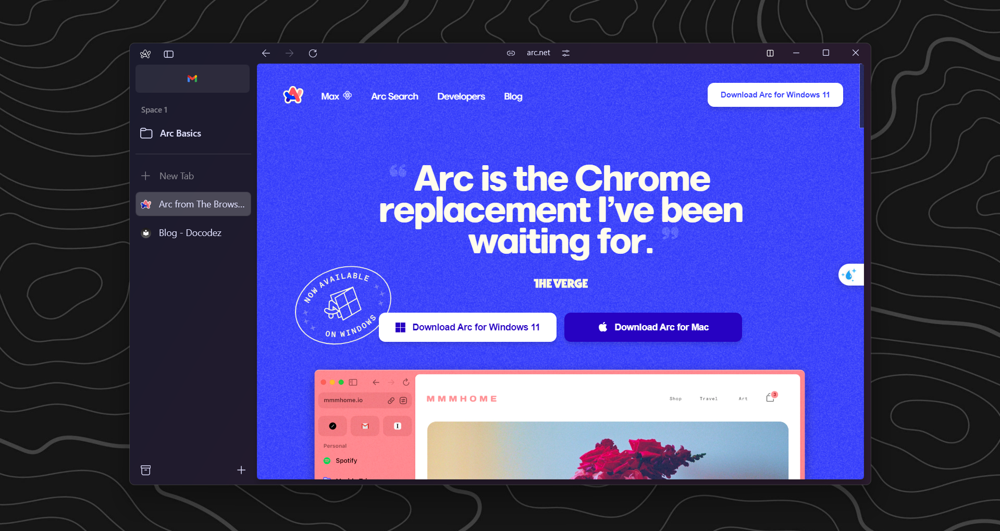
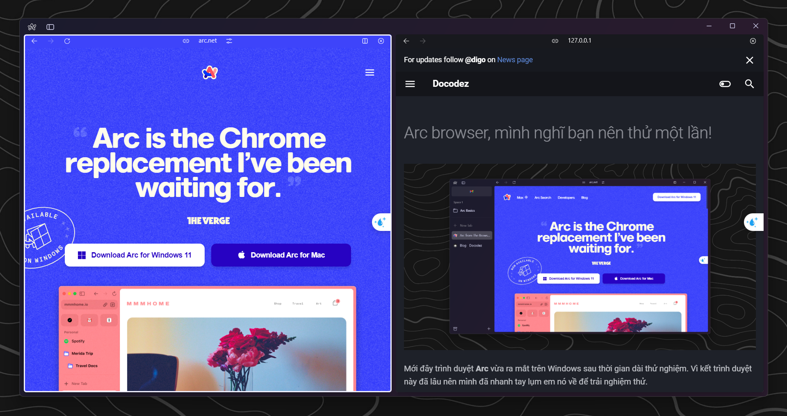

# Arc browser, mình nghĩ bạn nên thử một lần!

<!-- more -->

Mới đây trình duyệt **Arc** vừa ra mắt trên Windows sau thời gian dài thử nghiệm. Vì kết trình duyệt này đã lâu nên mình đã nhanh tay lụm em nó về để trải nghiệm thử.

Sau 2 ngày trải nghiệm thì mình thực sự ấn tượng với trình duyệt này, và mình thấy rằng nó rất đáng để cho bạn thử. Dưới đây là một số điểm mình thấy hay ho ngoài những chức năng chung mà trình duyệt nào cũng phải có ở cái trình duyệt này.

*lưu ý: mình không phải cao siêu gì nên những điểm mình nêu ra dưới đây đều là ý kiến chủ quan từ cá nhân mình*

## Giao diện đẹp

Với mình thì cứ cái gì đẹp đập vào mắt là phải trải nghiệm ngay luôn cho nó đã đời và giao diện của Arc đã hoàn toàn khiến mình mê mẩn từ cái nhìn đầu tiên. Nó thực sự rất đẹp.

### Sidebar (thiết kế mới lạ)

Thanh tiêu đề đã mỏng hơn rất nhiều so với các trình duyệt khác vì danh sách tabs đã được chuyển sang bên trái màn hình (phần sidebar). Bây giờ khi truy cập tab mới, hay đổi tab thì chúng ta có thể thao tác ở phần bên trái màn hình thay vì bên trên cùng màn hình như trước.

Chính thiết kế này đã giúp cho giao diện cũng thuận tiện hơn nhiều ngoài ra chúng ta có thêm môt phần không gian để lướt web (sidebar này có thể ẩn đi để tiết kiệm không gian).

### Split view (cũng hay ho)

Cái này mình thấy cũng có một số trình duyệt đã có và cũng có extension có thể giúp bạn làm điều này, tuy nhiên mình vẫn thầy rất ấn tượng.

