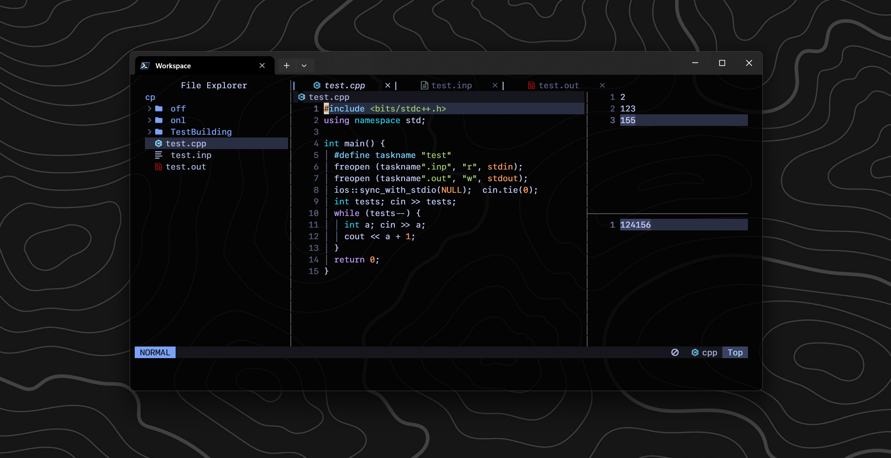

# Mình đã set up Neovim cho CP như thế nào?



<!-- more -->

Là một người nghiện dùng nvim nên đến với chuyên mục ngày hôm nay, mình sẽ hướng dẫn các bạn set up Neovim để lập trình thi đấu bằng C++ một cách đơn giản nhất và đầy đủ nhất.

Trước tiên, đây không phải setup do mình tự làm ra từ đầu mà mình đã dựa trên [LunarVim/Launch.nvim](https://github.com/LunarVim/Launch.nvim){ target="_blank" } sau đó thì custom lại bằng cách thêm plugins, sửa key-binding,... cho đúng ý mình. Vì vậy bạn cũng hoàn toàn có thể tự tạo cho bản thân một bản setup cá nhân như mình đã làm, hoặc nếu không thì bạn hoàn toàn có thể sử dụng setup của mình 😄 Dưới đây sẽ là hướng dẫn bạn sử dụng setup của mình nha.

## Cài đặt

Đây là setup mà mình đã sử dụng: [theryou/nvim](https://github.com/theryou/nvim.git){ target="_blank" }, nếu không biết cách cài đặt như thế nào hãy làm theo bên dưới 👇

Đầu tiên bạn cần đảm bảo rằng bạn cài [neovim](https://neovim.io/){ target="_blank" } và [git](https://git-scm.com/downloads){ target="_blank" }.

Tiếp theo đó hãy cài đặt **Mingw-w64**. Trên windows bạn có thể sử dụng [scoop](https://scoop.sh/){ target="_blank" } (với lệnh `scoop install mingw`). Với các hệ điều hành khác như Macos, Linux bạn có thể dùng `brew install mingw-w64`.

Nếu đang sử dụng Windows hãy cài thêm [Windows Terminal](https://apps.microsoft.com/detail/9n0dx20hk701?hl=vi-VN&gl=VN){ target="_blank" } và [Powershell](https://apps.microsoft.com/detail/9mz1snwt0n5d?hl=en-US&gl=US){ target="_blank" }. Bạn có thể tham khảo cách [custom Windows Terminal & Powershell](https://dev.to/slydragonn/how-to-set-up-the-windows-terminal-with-powershell-and-oh-my-posh-2ba4){ target="_blank" }.

Ok tới đây thì bạn chỉ cần tải bản setup của mình về là được rồi:

- Trên Windows hãy sử dụng Terminal và Powershell mà bạn đã tải ở bên trên sau đó chạy lệnh sau:

```
git clone https://github.com/theryou/nvim.git $env:LOCALAPPDATA\nvim
```

- Trên Macos hoặc Linux hãy chạy lệnh sau:

```
git clone https://github.com/theryou/nvim.git ~/.config/nvim
```

Như vậy là đã hoàn thành rồi, bây giờ hãy thử chạy lệnh `nvim` để chiêm ngưỡng thành quả nào.

